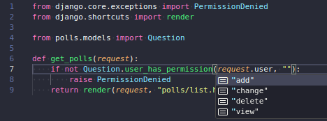

## Welcome to django-typed-perms

This project was built to simplify and enhance your DX (Developer Experience) using the Django Permission System.
If you ever felt the Django's built-in permission checking is not very friendly, and prone to silly typing errors, then you'll like this package.

## Overview

With this package you can check for permissions and ensure that you're using the right permission codename, without much effort. You can use `django-typed-perms` only where you find it useful.
The code examples uses the models from the Django Tutorial.

### Django default permission check

First, let's start on the Django default way of doing it. If you need to check for permission on a view, one way of doing it, is by doing the following:

``` py title="polls/views.py"
# Default way
from django.core.exceptions import PermissionDenied
from django.shortcuts import render

from polls.models import Question

def get_polls(request):
    if request.user is None or not request.user.has_perm("polls.view_question"):
        raise PermissionDenied
    questions = Question.objects.all()
```

The bad thing of doing the default way, is that:
* You can easily make mistake or forget how the permission codename (`polls.view_question`) is named. Is the action first, the model? And the model name can also get really unreadable if its a long name.
* You don't know right away which permissions are available, for a specific model.
* You must take into consideration that `request.user` may be `None`.
* You don't get any auto-complete from your IDE or static checking from mypy.


### Lets make it better

The only thing you need to do is add the `TypedPermsModelMixin` class to a Django Model of your choice.
Since this class is a mixin, its required that you add it before the `models.Model` class.

``` py title="polls/models.py"
from django.db import models
from django_typed_perms import TypedPermsModelMixin

class Question(TypedPermsModelMixin, models.Model):
    # fields go here...
```

That's it! You'll learn a few more tricks later on.

This class will add some methods to your model, this methods can then be used to check permissions from your model. Let's check out how we can use these methods to enhance our permission checking.

``` py title="polls/views.py"
from django.core.exceptions import PermissionDenied
from django.shortcuts import render

from polls.models import Question

def get_polls(request):
    if not Question.user_has_permission(request.user, "view"):
        raise PermissionDenied
    ...
```

Notice that, you're inverting how you're essentially checking for the permission, now the permission check 'starts' from the model (`Question`), using the method `user_has_permission`. This method is defined on the `TypedPermsModelMixin` and its does exactly the same as the `user.has_perm` method, but with a few shortcuts! So what's the big deal then?

* When you're using the `TypedPermsModelMixin` way, you'll be able to view all the possible permissions for that model, with your IDE auto-complete.

* You just need to provide the "action" instead of the full permission codename.
* You don't need to remember the app name, neither the model name.
* You don't need to check `request.user` for a `None` value.


And that's just the basic, check out more on the Reference section.
